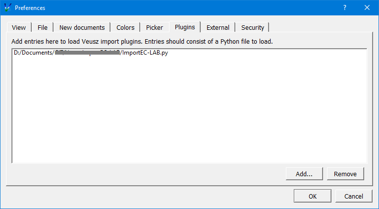
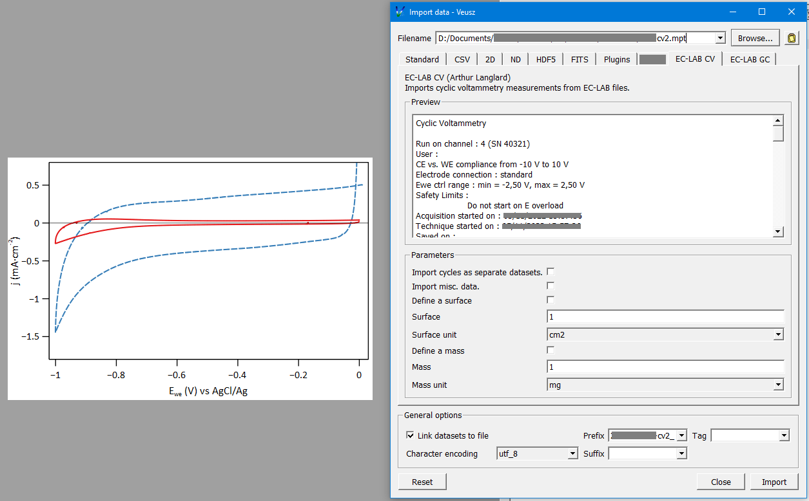
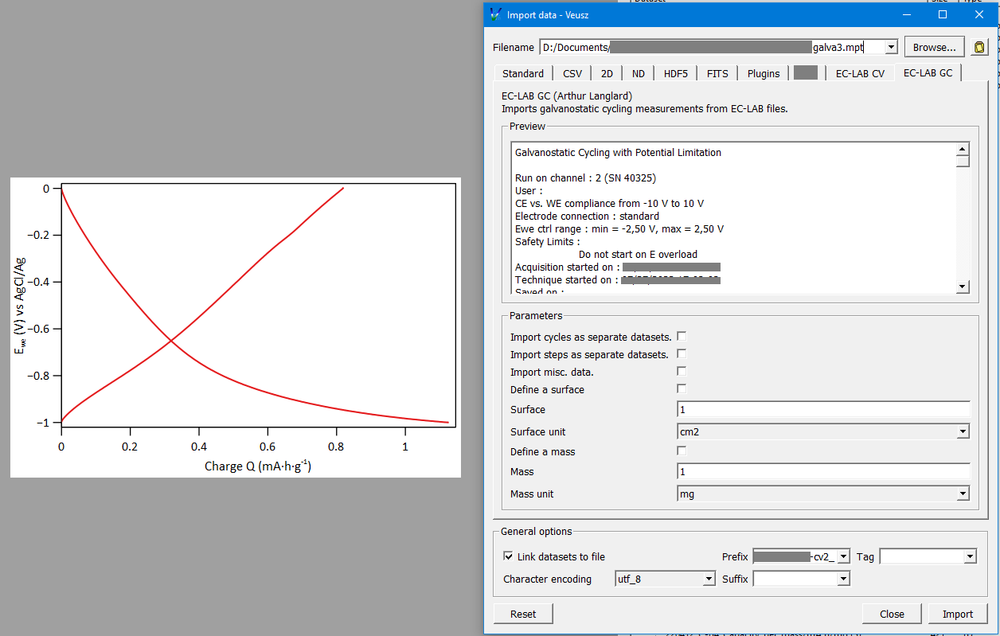

# Veusz-ImportEC-LAB
This software is a plugin for the Veusz software. It is designed to load electrochemical measurements files from the EC-LAB software.
It supports cyclic voltammetry (CV) and galvanostatic (GC) measurements.

## How to use the plugin
1. Add the plugin to the list of Veusz's plugins:
Edit -> Preferences -> Plugins -> Add. Then select the file ImportEC-LAB.py.

Veusz has to be restarted in order to load the plugin.

2. Use the plugin:
Cyclic voltammetry data: Data -> Import -> EC-Lab CV

Galvanostatic data: Data -> Import -> EC-Lab GC

